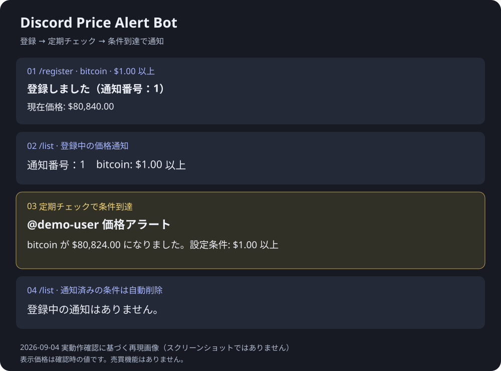

# Discord Price Alert Bot｜価格監視・自動通知Bot

**Pythonで「外部サービスの情報取得 → 条件判定 → Discord通知 → 設定保存」を組み合わせた、小規模Botの開発サンプルです。**

この作品では暗号資産の価格を題材に、毎回サイトを開いて確認する作業を自動化しました。Discordで銘柄と目標価格を登録すると、Botが既定で5分ごとに確認し、条件を満たした際に登録先のチャンネルへ通知します。設定は再起動後も残ります。

Discord Bot開発、外部API連携、SQLiteによるデータ保存、定期処理、基本的なエラー処理、自動テストの実装例を確認できます。

本作品は**AI支援を活用した個人の自主制作**です。受託案件の納品実績ではありません。実際のDiscordサーバーで主要機能と再起動後の設定保持を確認し、自動テスト5件が成功しています。売買機能はありません。

[動作デモ](#利用イメージ) · [対応可能な案件例](#対応可能な案件例) · [実装済みと未実装の範囲](#実装済みと未実装の範囲) · [テスト結果](#テスト) · [導入手順](#セットアップ)

## この作品で確認できる開発内容

| 開発内容 | 依頼者にとってできること | 実装・確認の根拠 |
| --- | --- | --- |
| Discord Bot開発 | Discord内で通知の登録・一覧確認・削除を操作 | [bot.py](bot.py)／実サーバーで確認 |
| 外部API連携 | 外部サービスから情報を取得し、通知に利用 | [api_client.py](api_client.py)／CoinGeckoの価格取得を確認 |
| SQLiteによる保存 | Botを再起動しても登録設定を保持 | [database.py](database.py)／再起動テストで確認 |
| 定期処理 | 人が毎回操作せずに条件を確認 | [bot.py](bot.py)／定期チェックからの通知を確認 |
| 基本的なエラー処理 | 一時的な通信失敗を再試行し、取得失敗や重複登録を案内 | [api_client.py](api_client.py)・[bot.py](bot.py)／障害時の実環境テストは未実施 |
| 自動テスト | 保存・削除・本人以外の削除防止・価格条件を繰り返し検証 | [tests](tests/)／5件成功。全機能を網羅するテストではありません |

## できること

| コマンド | 内容 |
| --- | --- |
| `/register` | 銘柄・目標価格・上昇/下落条件を登録 |
| `/list` | 自分が登録した通知を一覧表示 |
| `/delete` | 通知番号を指定して削除 |
| `/price` | 指定銘柄の現在価格をその場で確認 |

登録・一覧・削除の応答は操作した本人だけに表示し、条件到達時の通知は登録先チャンネルへメンション付きで送ります。設定の操作は登録者ごとに分け、同じサーバーでも他人の通知は削除できないようにしています。

## 利用イメージ



画像は2026年9月4日の実動作をもとに、個人情報を除き、表示を整理した再現図です。実際の画面そのものではありません。画像内の価格は動作確認時の値であり、現在価格ではありません。以下のテキストは操作例です。

```text
/register coin_id:bitcoin target_price:100000 direction:目標価格以上

Bot:
通知 #1 を登録しました。
bitcoin が $100,000.00 以上
現在価格: $96,500.00
```

条件に到達すると、登録したチャンネルへ次のように通知します。

```text
🔔 @user 価格アラート
bitcoin が $100,120.50 になりました。
設定条件: $100,000.00 以上
```

## 対応可能な案件例

本作品の実装を基礎として、次のような**小規模なBot・通知ツールの開発をご相談いただけます**。以下は応用先の例であり、納品済みの案件一覧ではありません。実際の対応可否と範囲は、ご希望の機能・連携先の仕様を確認して判断します。

| ご相談の例 | この作品で活かせる部分 | 追加開発・事前確認が必要な部分 |
| --- | --- | --- |
| Discordで通知条件を登録・管理するBot | コマンド操作、本人ごとの一覧・削除、設定保存 | 独自の入力項目、管理者権限、運用ルール |
| 公開APIの数値が条件を満たしたら通知するツール | 情報取得、上限・下限の判定、Discord通知 | 対象APIの認証・利用条件・取得回数の制限 |
| 定期的な情報確認を自動化するツール | 一定間隔のチェック、通信失敗時の再試行 | 取得対象、通知タイミング、継続稼働する環境 |
| 再起動しても設定を保持する小規模Bot | SQLiteへの保存・読み出し・削除 | 新しい保存項目、データ量、バックアップ方針 |

ご相談の際は「何を確認したいか」「どんな条件で誰に通知したいか」「確認する頻度」「利用人数」「常時稼働が必要か」をお知らせください。技術用語ではなく、普段行っている作業の説明からでも要件を整理できます。

## 実装済みと未実装の範囲

### 実装済み

- 4つのDiscordコマンドと、価格条件に応じた一度きりの通知
- CoinGeckoからの米ドル価格取得と、複数銘柄の一括取得
- SQLiteによる設定保存、本人の設定だけを一覧表示・削除する制御
- 定期処理（既定5分。設定ファイルで間隔を変更）
- 通信のタイムアウト、一時障害などでの再試行、送信失敗時のログ出力
- トークンの環境変数管理、導入手順、自動テスト

### 未実装・追加開発が必要

- CoinGecko以外のサービス連携、米ドル以外での価格表示
- Web管理画面、管理者向けコマンド、通知履歴
- Docker化、クラウドへの常時稼働環境の構築
- 大量登録向けの一覧分割・登録数制限、複数プロセスでの運用対応
- 売買注文・自動取引（本サンプルの対象外）

PC停止・スリープ中は監視できません。長期稼働や大規模運用を保証する完成サービスではなく、小規模Botの実装例です。[テストの範囲](#テスト)と[運用上の注意](#注意事項)もあわせてご確認ください。

## 使用技術

- Python 3.11+
- discord.py 2.x
- aiohttp / REST API
- SQLite
- CoinGecko API
- unittest

## セットアップ

ここからは、ご自身のDiscordサーバーで動かしたい方向けの手順です。ソースコードをダウンロードまたはクローンし、`bot.py`があるフォルダで以下のコマンドを実行してください。

動作確認環境はWindows・Python 3.12です。必要なライブラリは[requirements.txt](requirements.txt)、設定項目は[.env.example](.env.example)を参照してください。トークンを発行するためのDiscordアカウントと、Botを招待できるテスト用サーバーが必要です。

### 1. Discord Botを作成

1. [Discord Developer Portal](https://discord.com/developers/applications)でApplicationを作成します。
2. `Bot`画面からBotを追加し、トークンを取得します。
3. `OAuth2 > URL Generator`で `bot` と `applications.commands` を選択します。
4. Bot権限で `View Channels` と `Send Messages` を選び、生成されたURLからサーバーへ招待します。

このBotはメッセージ本文を読む必要がないため、Message Content Intentは不要です。

### 2. Python環境を準備

```powershell
python -m venv .venv
.venv\Scripts\Activate.ps1
python -m pip install -r requirements.txt
```

macOS / Linuxの場合:

```bash
python3 -m venv .venv
source .venv/bin/activate
python -m pip install -r requirements.txt
```

### 3. 環境変数を設定

`.env.example`をコピーして`.env`を作り、Discord Botのトークンを設定します。

```env
DISCORD_TOKEN=取得したBotトークン
CHECK_INTERVAL_MINUTES=5
DATABASE_PATH=alerts.db
LOG_LEVEL=INFO
```

`.env`とSQLiteファイルは`.gitignore`で除外しています。ただし、すでにGitで追跡しているファイルや手動アップロードには効かないため、公開前に必ず対象を確認してください。トークンはREADMEや画像にも載せないでください。

### 4. 起動

```powershell
python bot.py
```

起動後、Discordサーバーでスラッシュコマンドが使えるようになります。グローバルコマンドの反映には時間がかかる場合があります。

## 銘柄IDについて

`coin_id`にはティッカーではなくCoinGeckoのIDを指定します。例: Bitcoinは`bitcoin`、Ethereumは`ethereum`、Solanaは`solana`です。

## テスト

```powershell
python -m unittest discover -s tests -v
```

データベースの登録・一覧・削除・権限制御と、価格条件の判定を外部APIやDiscord接続なしで確認できます。

自動テスト5件の対象は、登録から削除までの一連の操作、他ユーザーによる削除の拒否、不正な条件種別の拒否、上限・下限の判定です。価格判定では目標値と等しい場合も確認しています。Discord接続・API通信は、この自動テストには含まれません。

### 実動作の確認結果

2026年9月4日、Windows環境・Python 3.12・テスト用Discordサーバーで確認しました。

| 項目 | 結果 |
| --- | --- |
| `/price` から外部APIの価格を取得 | 成功 |
| `/register` で登録し `/list` に表示 | 成功 |
| 定期チェックによるメンション付き通知 | 成功 |
| 通知後に対象条件を自動削除 | 成功 |
| `/delete` による手動削除 | 成功 |
| 存在しない通知番号への案内 | 成功 |
| Bot再起動後も通知 #3 の設定を保持 | 成功 |
| 自動テスト | 5件成功 |

API障害・レート制限・権限不足の実環境での強制発生テスト、長期連続稼働、大量登録の負荷テストは未実施です。

### デモを再現する手順

1. `/price coin_id:bitcoin` で価格取得を確認します。
2. `/register` で `bitcoin`、目標価格 `1`、`目標価格以上` を登録します。
3. `/list` で一覧を確認します。
4. 次の定期チェックを待ちます（既定は5分間隔。API障害時などは遅れる場合があります）。
5. 通知後の `/list` が空になることを確認します。
6. `bitcoin`、目標価格 `1`、`目標価格以下` を登録し、Botを停止・再起動して `/list` に残ることを確認します。
7. 表示された番号を `/delete` に指定し、テスト用の登録を削除します。

これは通知テストであり、売買注文は一切行いません。

## 構成

```text
discord-price-alert-bot/
├── bot.py                 # Discordコマンドと定期処理
├── api_client.py          # CoinGecko API通信とリトライ
├── database.py            # SQLite操作
├── logic.py               # 価格到達の判定ロジック
├── config.py              # 環境変数の読み込み
├── docs/demo.svg          # 個人情報を除いたデモ画像
├── tests/
│   ├── test_bot_logic.py
│   └── test_database.py
├── .env.example
├── .gitignore
├── requirements.txt
└── README.md
```

## 設計上のポイント

- Discordの処理を止めないよう、SQLite操作は別スレッドで実行しています。
- 登録銘柄をまとめて取得し、APIへのリクエスト数を抑えています。
- レート制限や一時障害などの取得失敗では、1秒・2秒の待機を挟み、初回を含め最大3回取得を試みます。1回の通信には10秒のタイムアウトを設定しています。
- 削除時はサーバーIDとユーザーIDを照合し、本人の登録だけを操作します。
- 正常に通知を送信した後に条件を削除し、通常時の繰り返し通知を防いでいます。送信直後の停止などに対する重複防止は保証していません。

## 注意事項

- Botのプロセスが動いている間だけ監視します。PC停止・スリープ中は通知できません。
- 小規模・単一プロセスでのデモ利用を想定しています。
- 通知送信とDB削除は一つの処理として保証されていないため、その間に停止すると再通知される可能性があります。
- 通知先の削除や権限不足により送信できない場合は登録を保持し、ログを出力します。
- 大量登録向けの一覧分割や登録数制限は未実装です。
- エラー処理は通信失敗やDiscord送信失敗などを対象とした基本的なものです。予期しないAPI応答形式やデータベース障害を含む、あらゆる例外からの自動復旧は実装していません。

このリポジトリは技術デモです。取得価格の正確性・リアルタイム性を保証するものではなく、投資判断を目的としていません。CoinGecko APIの利用条件とレート制限に従って使用してください。
